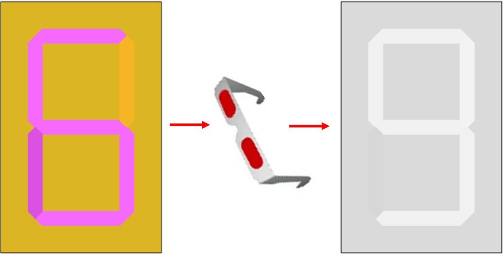
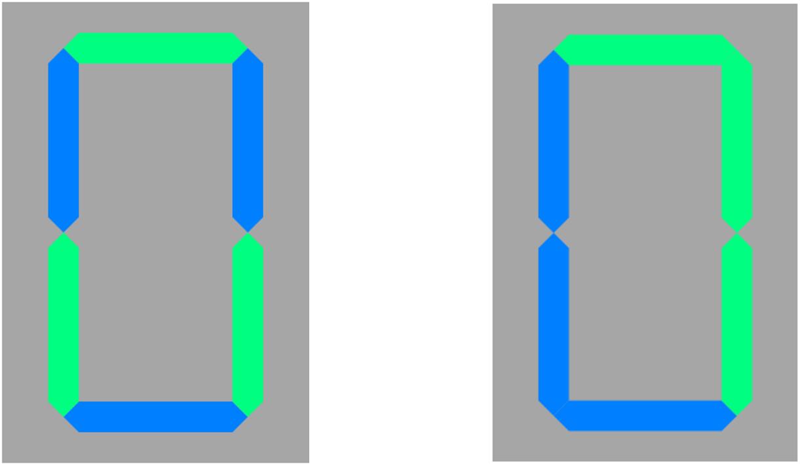
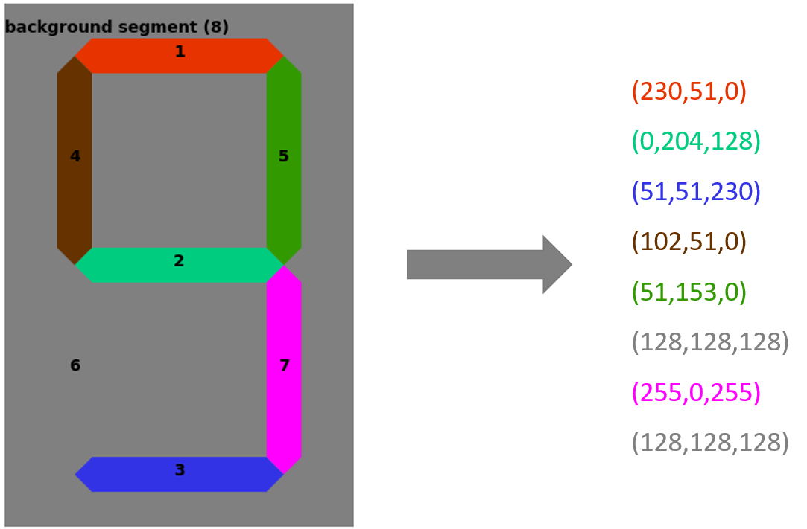
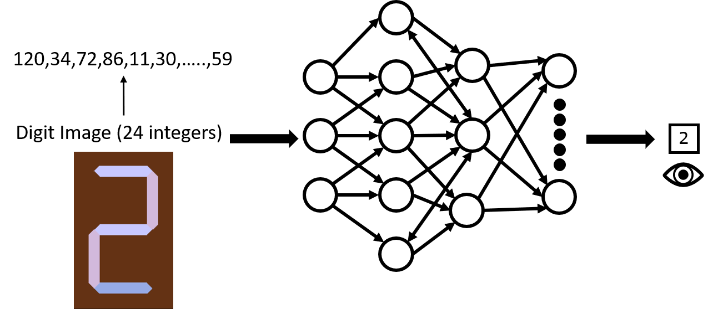
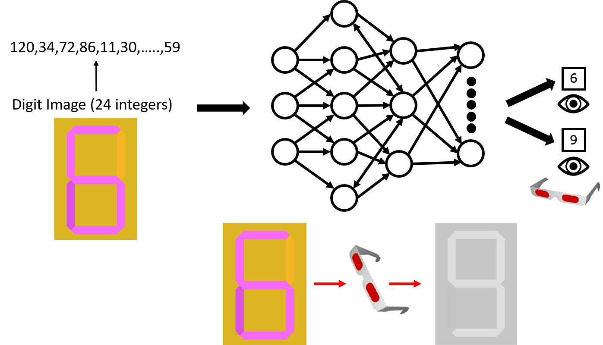
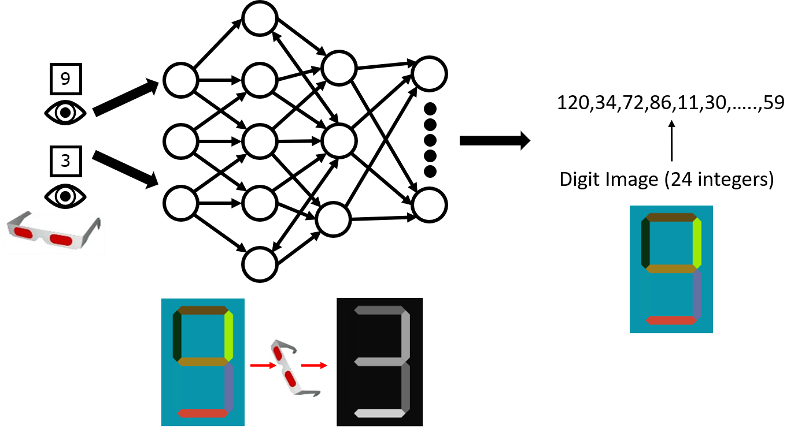

# Outline
## Motivation
## Hiding Scheme

## Simple Vs. Ambiguous data samples

## Data Representation

## Classification of seen image

## Classification of seen & hidden image

## Generation of hiding scheme image

